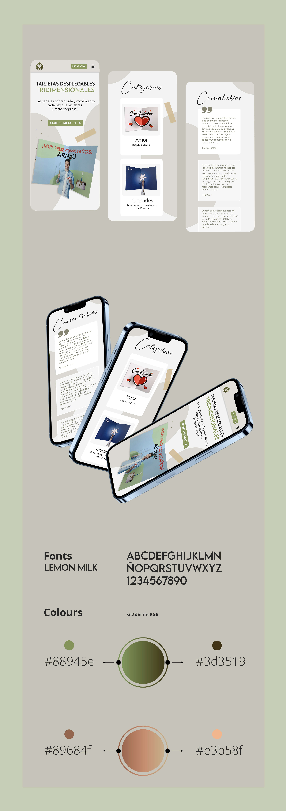
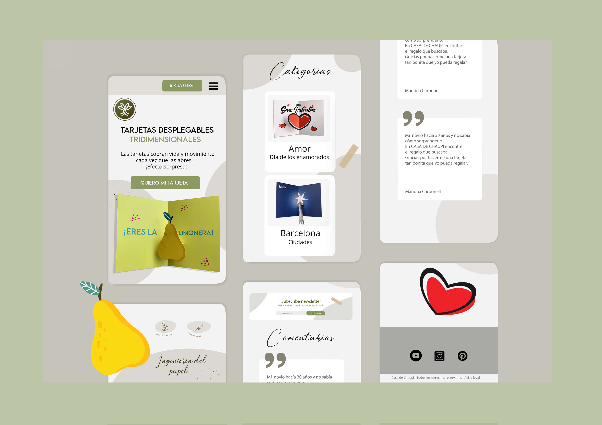
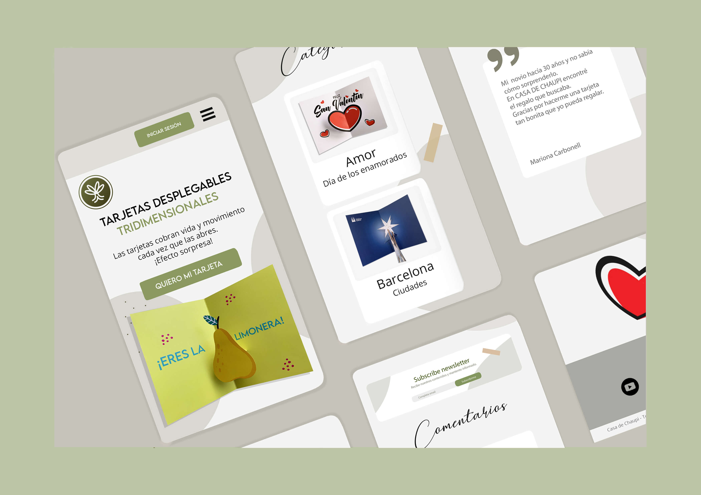
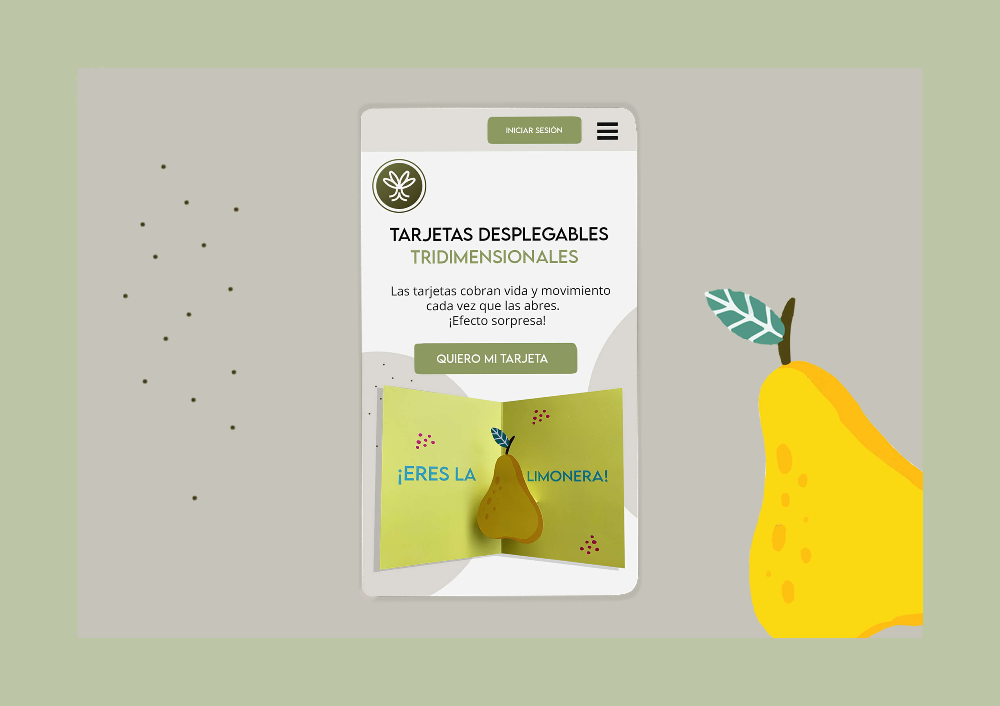

# Pop up cards Casa de Chaupi App

An exciting project of pop up cards, using the paper engineering to give movement and surprise effect every time it is opened in front of your eyes.

# What is this app about?

Personalized cards in three-dimensional technique
format, with the paper engineering, like the books we had as children.

Where we get really surprise watching the movements of the pages.

# Technology used

- React JS
- CSS
- Context
- React Icons
- React Router DOM

Responsive web for the latest mobile version 😃

Here is a shot of our landing page, responsive mobile version of the website from the previous version.

<!-- 

 -->

We hope you are happy with the results, do not hesitate to give me feedback, thank you! 😃

My Social Media Accounts: 
[Instagram](https://instagram.com/casadechaupi?igshid=YmMyMTA2M2Y=), [Pinterest](https://pin.it/6H02uUe) OR [Youtube](https://www.youtube.com/@casadechaupi1284)

_Copyright © by Casa de Chaupi 2022._